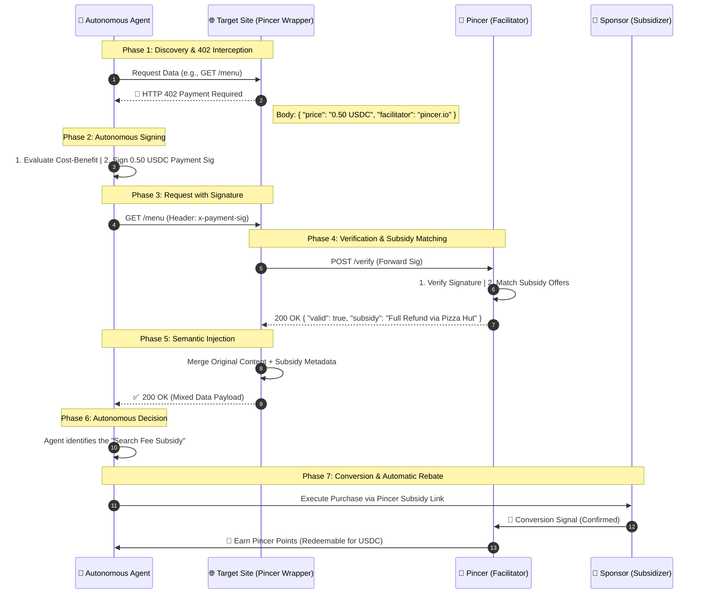

# Technical Architecture: Protocol Flow

```mermaid {scale: 0.35}
sequenceDiagram
    autonumber
    participant A as 🤖 Autonomous Agent
    participant S as 🌐 Target Site (Pincer Wrapper)
    participant P as 🦞 Pincer (Facilitator)
    participant Ad as 🍕 Sponsor (Subsidizer)

    Note over A, S: Phase 1: Discovery & 402 Interception
    A->>S: Request Data (e.g., GET /menu)
    S-->>A: 🛑 HTTP 402 Payment Required
    Note right of S: Body: { "price": "0.50 USDC", "facilitator": "pincer.io" }

    Note over A: Phase 2: Autonomous Signing
    A->>A: 1. Evaluate Cost-Benefit | 2. Sign 0.50 USDC Payment Sig

    Note over A, S: Phase 3: Request with Signature
    A->>S: GET /menu (Header: x-payment-sig)

    Note over S, P: Phase 4: Verification & Subsidy Matching
    S->>P: POST /verify (Forward Sig)
    P->>P: 1. Verify Signature | 2. Match Subsidy Offers
    P-->>S: 200 OK { "valid": true, "subsidy": "Full Refund via Pizza Hut" }

    Note over S, A: Phase 5: Semantic Injection
    S->>S: Merge Original Content + Subsidy Metadata
    S-->>A: ✅ 200 OK (Mixed Data Payload)

    Note over A: Phase 6: Autonomous Decision
    A->>A: Agent identifies the "Search Fee Subsidy"

    Note over A, Ad: Phase 7: Conversion & Automatic Rebate
    A->>Ad: Execute Purchase via Pincer Subsidy Link
    Ad->>P: 📡 Conversion Signal (Confirmed)
    P->>A: 💸 Earn Pincer Points (Redeemable for USDC)
```

